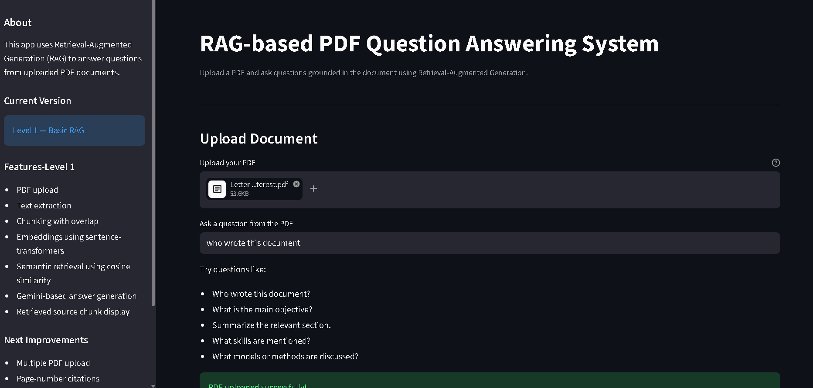
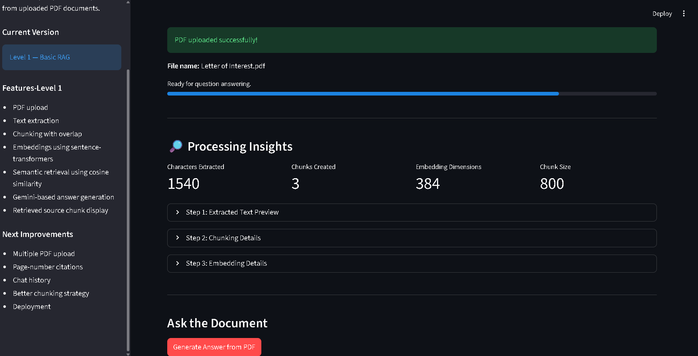
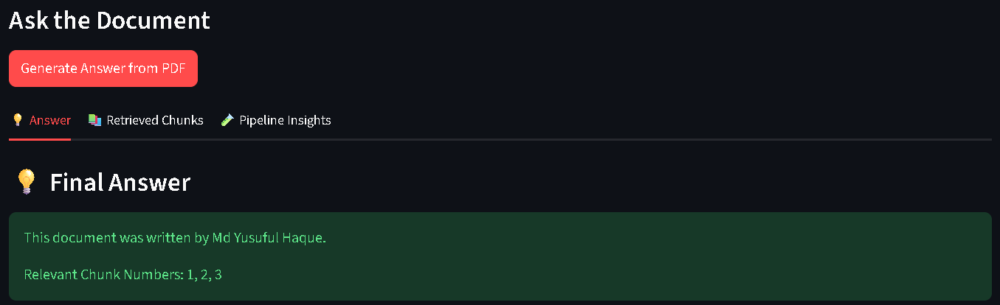
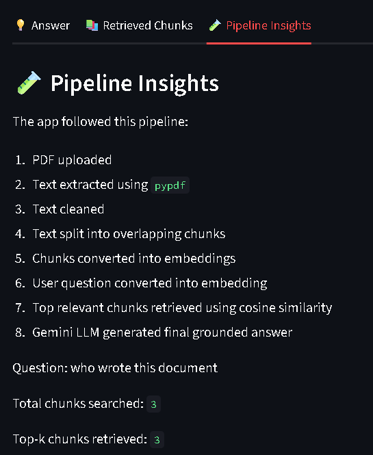

# RAG-based PDF Question Answering System

A document question-answering application that allows users to upload a PDF and ask natural-language questions from it.  
The system retrieves the most relevant document chunks using semantic search and generates grounded answers using an LLM.

## Demo

## Problem Statement

Large PDF documents are difficult to search manually. Users often need quick answers from long documents such as reports, resumes, research papers, notes, or books.

This project solves that problem by building a Retrieval-Augmented Generation pipeline that extracts text from PDFs, retrieves relevant chunks, and generates answers based only on the uploaded document.

## Features

- Upload a PDF document
- Extract text from PDF using `pypdf`
- Clean and split text into overlapping chunks
- Generate embeddings using `sentence-transformers`
- Retrieve relevant chunks using cosine similarity
- Generate grounded answers using Gemini API
- Display retrieved source chunks for verification
- Handle missing information by instructing the model to answer only from document context

## Tech Stack

| Component | Technology |

| Frontend | Streamlit |
| PDF Parsing | pypdf |
| Embeddings | sentence-transformers |
| Retrieval | NumPy cosine similarity |
| LLM | Google Gemini API |
| Language | Python |
| Environment | python-dotenv |

## Architecture

User Uploads PDF
        ↓
PDF Text Extraction using pypdf
        ↓
Text Cleaning
        ↓
Text Chunking with Overlap
        ↓
Embedding Generation using sentence-transformers
        ↓
Semantic Similarity Search using Cosine Similarity
        ↓
Top Relevant Chunks
        ↓
Gemini LLM Answer Generation
        ↓
Answer +Retrieved Source Chunks

                                             ## HOW IT WORKS

## 1. PDF Text Extraction

The uploaded PDF is parsed using pypdf. The text is extracted page by page and passed into the preprocessing pipeline.

## 2. Text Chunking

The extracted text is split into overlapping chunks. Chunking is needed because large documents cannot be sent fully to the LLM, and retrieval works better on smaller meaningful pieces.

## 3. Embedding Generation

Each chunk is converted into a numerical vector using the all-MiniLM-L6-v2 model from sentence-transformers.

## 4. Semantic Retrieval

The user question is also converted into an embedding. Cosine similarity is used to compare the question embedding with all chunk embeddings. The top relevant chunks are selected.

## 5. LLM Answer Generation

The retrieved chunks and user question are sent to the Gemini API. The prompt instructs the model to answer only using the retrieved PDF context.